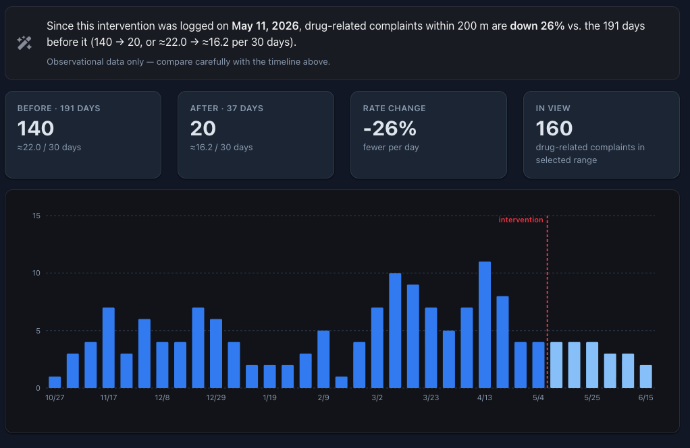

# Does the data support my hypothesis?

**A self-serve tool that shows whether a local intervention actually moved the data — and, alongside the district dashboards, whether the problem simply moved nearby.**

## Why it exists

City staff constantly change the environment in response to resident complaints — new lighting, trimmed sightlines, a staffing shift, an enforcement push. But confirming whether a change *worked* usually means waiting for a report or making a judgment call. This tool gives any pod member a fast, neutral, same-day read from live public data — no analyst required.

## How it works

1. **Describe the intervention** — what you did, and drop a pin where you did it.
2. **Pick what you expected to change** — one of 14 vetted signals (drug activity, encampments, dumping, graffiti, noise, and more), each tied to a specific open-data source.
3. **Read the result** — the tool queries live SF OpenData within a radius of your pin and shows a plain-language **before/after verdict**, a **trend chart**, **stat cards**, and a **map of every underlying report** — plus the exact query behind every number.

## See it in action

A plainclothes-officer deployment in the Central Police District, logged May 11, 2026, expected to reduce drug-related activity.

**Result: community-reported drug calls within 200 m fell about a quarter (−26%)** after the intervention — from a rate of ≈22 to ≈16 calls per 30 days. The tool measures *residents calling about drug activity*, not officer-initiated stops, so the drop reflects a real change in what the neighborhood was experiencing.

*The tool reports a per-day rate, so the uneven before/after window (191 days vs. 37) can't inflate the result.*

## Part of a larger system

This tool answers a **local** question: *did my intervention move the data right here?* The district dashboards answer the **wider** one: *did that activity just move nearby?* Their hot/cold maps — **"Hotspots: what moved"** and **"what changed"** — reveal where a behavior faded and where it reappeared across a whole district over time.

Together they guard against the classic trap: a local win that is really just displacement. Zoom in to confirm the effect; zoom out to check it didn't push the problem onto the next block.

## Built responsibly

- **Live public data.** Every signal comes from [data.sfgov.org](https://data.sfgov.org); the tool runs the query in your browser.
- **Fully reproducible.** Each result shows the dataset and the exact runnable query, so anyone can verify the number.
- **Honest by design.** The tool reports rates (not raw counts), flags short or unreliable windows.

## Who it's for & how to see it

Built for Neighborhood Safety pod leaders and intervention owners; useful to anyone tracking whether local action is working.

**[See this analysis live](https://mayor-s-office-of-innovation.github.io/intervention-evaluation/hypothesis/?dp=drug&date=2026-05-11&lat=37.78900&lng=-122.41598&r=200&from=2025-11-01&to=2026-06-16&what=plain+clothes+officers)** · **[Explore the dashboards](https://mayor-s-office-of-innovation.github.io/intervention-evaluation/)** · **[View the code](https://github.com/Mayor-s-Office-of-Innovation/intervention-evaluation)**

---